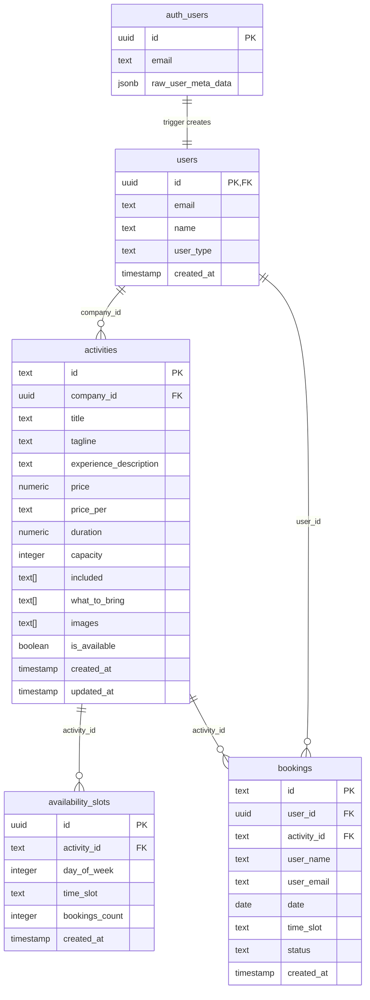

# Architecture

This document describes the structure of the Tokuma platform — an activity-booking web app built with Next.js 15, React 19, and Supabase (Postgres + Auth + Storage).

---

## 1. Database Schema

Four tables live in the `public` schema and extend Supabase's managed `auth.users` table.



### Table roles

| Table | Purpose |
|---|---|
| `users` | Extends `auth.users` with app-level profile: name, user_type (`user` / `company` / `philanthropist`), and company experience level. |
| `activities` | Listings created by company accounts. `images` stores Supabase Storage paths (migrated from base64 in A3). `capacity` is the per-slot limit. |
| `availability_slots` | Each row is one recurring weekly time slot for an activity (`day_of_week` 0-6, `time_slot` e.g. "09:00"). `bookings_count` is incremented atomically by the `book_activity_slot` RPC. |
| `bookings` | One row per confirmed booking. References both the user and the activity. `date` is the specific calendar date; `time_slot` is the chosen time. |

---

## 2. RLS Policy Strategy

Row-Level Security is enabled on all four tables. The general pattern is:

- **SELECT** is open or loosely filtered (activities and slots are publicly visible).
- **INSERT/UPDATE/DELETE** is always scoped to `auth.uid()`.

### Why `bookings_select_company` uses a subquery

```sql
-- bookings_select_company (from 001_create_tables.sql)
create policy "bookings_select_company"
  on public.bookings for select
  using (
    exists (
      select 1 from public.activities
      where activities.id = activity_id
        and activities.company_id = auth.uid()
    )
  );
```

A company user needs to see the bookings made for *their* activities. Booking rows are owned by the end user (`user_id = auth.uid()` on the companion `bookings_select_own` policy) — a company is never the `user_id` in a booking row.

A naïve `auth.uid() = user_id` check would therefore return **zero rows** for every company, because `user_id` always holds the paying customer's UUID. The subquery traverses `bookings → activities` to check whether the activity being booked belongs to the currently authenticated company. This cross-table join is the only way to express "this booking is for my activity" in a pure SQL policy.

### Policy summary

| Table | SELECT | INSERT | UPDATE | DELETE |
|---|---|---|---|---|
| `users` | anyone (003 migration) | own row | own row | own row |
| `activities` | all available, or own | own company | own company | own company |
| `availability_slots` | everyone | own company (via activities join) | own company (via activities join) | — |
| `bookings` | own user **or** company via subquery | own user | — | own user |

---

## 3. Auth Flow

### Sign Up

1. User fills the auth modal and clicks **Sign Up**.
2. `signup()` in `lib/auth-context.tsx` calls `supabase.auth.signUp()`, passing `name`, `user_type`, and optionally `companyExperience` / `accessCode` in `options.data` (stored in `auth.raw_user_meta_data`).
3. Supabase creates the row in `auth.users` and fires the `on_auth_user_created` trigger.
4. The trigger function `handle_new_user()` (`scripts/002_create_user_trigger.sql`) reads `raw_user_meta_data` and inserts a row into `public.users` with the user's name and type. The `on conflict do nothing` guard makes it idempotent.
5. Back in `signup()`, if the insert succeeded, the code also upserts the `public.users` row directly (belt-and-suspenders, in case the trigger fires after the JS resumes). For `philanthropist` accounts it additionally upserts into the `philanthropists` table.
6. Supabase emits an `SIGNED_IN` auth event; the `onAuthStateChange` listener in `AuthProvider` calls `fetchUserProfile()`, which queries `public.users` and hydrates the React `user` state.

### Function map in `lib/auth-context.tsx`

| Function | Role |
|---|---|
| `AuthProvider` | React context provider; owns session state and the Supabase client. |
| `initAuth` (inside `useEffect`) | Reads the initial Supabase session on mount to restore persisted login. |
| `fetchUserProfile(userId)` | Fetches the `public.users` row and sets `user` state (name, type, experience level). |
| `login(email, password)` | Thin wrapper around `supabase.auth.signInWithPassword`. |
| `signup(...)` | Creates auth user, upserts profile, optionally creates philanthropist record. |
| `logout()` | Calls `supabase.auth.signOut()` and clears React state. |

---

## 4. Activity Data Flow

### `fetchActivities()` step-by-step (`lib/activities-context.tsx`)

1. **Query** — joins `activities` with `users` to pull the company name in one round-trip:
   ```sql
   select *, company:users!activities_company_id_fkey(name)
   from activities
   order by created_at desc
   ```
2. **snake_case → camelCase transform** — Postgres column names follow the SQL convention (`company_id`, `experience_description`). The JavaScript/TypeScript layer uses camelCase (`companyId`, `experienceDescription`). Mapping at this boundary keeps both layers idiomatic and prevents Postgres naming conventions from leaking into React components.
3. **Image resolution** — each activity's `images` array may contain Supabase Storage paths (e.g. `abc123.jpg`) or plain HTTP URLs. `resolveImageUrls()` (`lib/storage.ts`) calls `createSignedUrl()` for storage paths and passes HTTP/local URLs through unchanged. Signed URLs expire after 1 hour.
4. **Slot fetch** — for each activity, availability slots are fetched separately and grouped by "next occurrence" date using the formula `(day_of_week - today.getDay() + 7) % 7` (A2 fix). Slots with the same date are collected into a `{ date, slots[] }` shape.
5. **State update** — `setActivities(activitiesWithSlots)` triggers a re-render; all consumers of `useActivities()` receive the updated list.

### Why separate slot fetching instead of a JOIN?

The slot grouping logic (computing the next calendar date per weekday) is application logic that cannot be expressed cleanly in a single SQL query. Fetching slots per activity keeps the query simple and puts the date arithmetic in TypeScript where it can be tested.

---

## 5. Known Limitations

These are architectural decisions that would be revisited in a production hardening pass:

1. **`id text primary key` on `activities`** — activity IDs are random hex strings (now UUIDs after A4 fix, but stored as `text` rather than the native `uuid` type). This prevents Postgres from optimising UUID comparisons and index storage. A proper `uuid` column with `default gen_random_uuid()` would be cleaner.

2. **No real-time updates** — availability and booking counts are only refreshed by calling `fetchActivities()` / `fetchBookings()` explicitly after mutations. Two users looking at the same activity page simultaneously will not see each other's bookings without a page reload. Supabase Realtime (Postgres `LISTEN/NOTIFY` over WebSocket) would fix this.

3. **Slot model uses `day_of_week`, not explicit dates** — `availability_slots.day_of_week` represents a recurring weekly schedule. This cannot represent one-off availability (e.g. "only available on 25 Dec"), seasonal blackouts, or per-occurrence capacity overrides. A `slot_dates` table linking slots to concrete calendar dates would be necessary for a real booking product.

4. **Signed URL expiry is not cached** — every `fetchActivities()` call regenerates 1-hour signed URLs for all activity images. Under high read traffic this produces unnecessary Supabase Storage API calls. A server-side cache (e.g. Vercel Edge Config or a Redis layer) keyed on storage path with a TTL shorter than 1 hour would eliminate redundant signing.

5. **No optimistic UI on booking** — `bookActivity()` waits for the full round-trip (RPC → `fetchActivities()` → `fetchBookings()`) before the UI updates. Users on slow connections see a frozen button. The correct fix is to apply an optimistic update immediately and roll back on error, following the pattern recommended by React Query / SWR.
